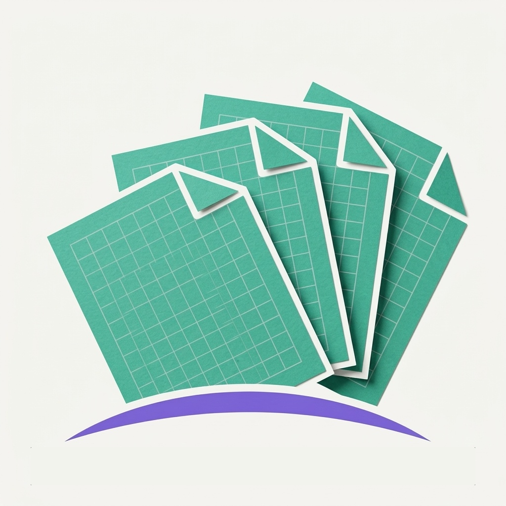
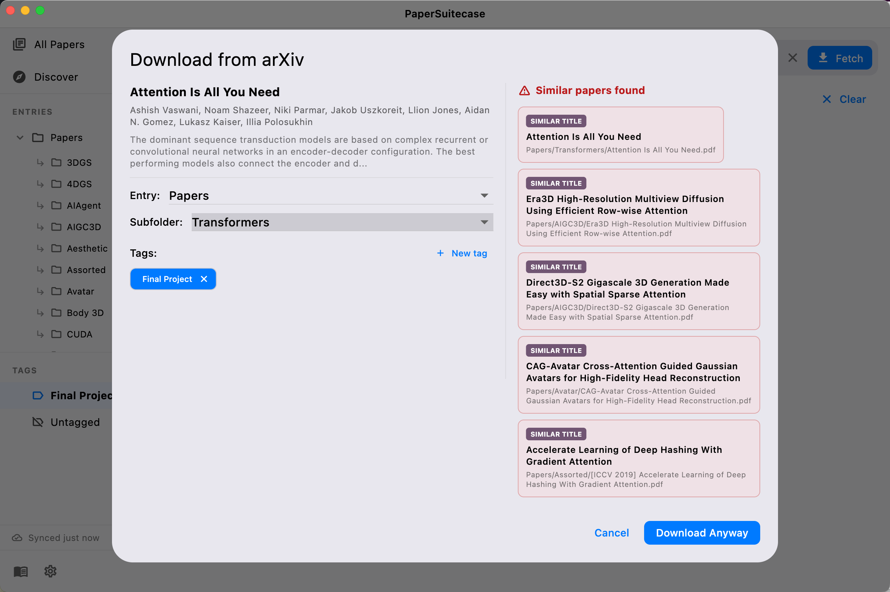
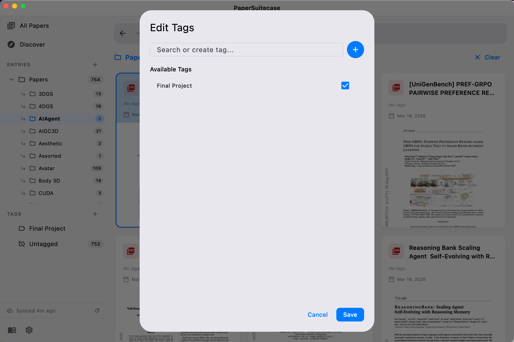
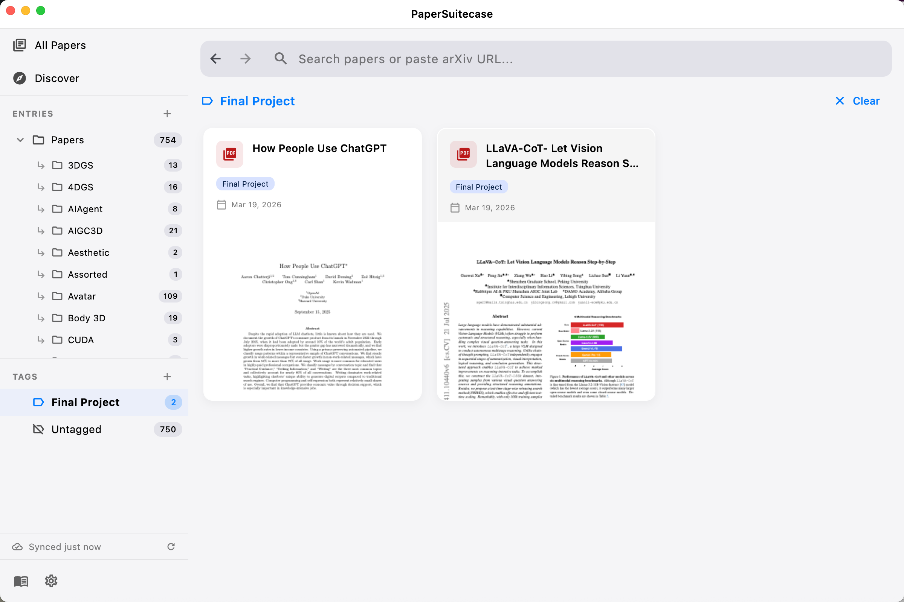

<p align="center">
  
</p>

<h1 align="center">PaperSuitcase</h1>

<p align="center">
  A desktop app for managing academic PDF papers with hierarchical tagging, full-text search, arXiv integration, and BibTeX support.
</p>

<p align="center">
  <a href="https://initialneil.github.io/papersuitcase-app/">Website</a>
</p>


## Features

- **Symlink-only entries** — Reference external folders without copying PDFs. Your files stay where they are.
- **Hierarchical tags** — Organize papers with nested tags and subfolder trees.
- **Full-text search** — FTS5-powered search across titles, authors, abstracts, and extracted text.
- **arXiv integration** — Paste an arXiv URL to download and auto-fill metadata.
- **BibTeX support** — Import and manage BibTeX references per entry.
- **Cloud sync** — Optional Supabase-backed sync across devices with auth.
- **Paper Q&A** — Chat with papers using LLM-powered Edge Functions.
- **Discover tab** — Collaborative, tag-based, and trending paper recommendations.

## Screenshots

| arXiv Download | BibTeX Manager |
|:-:|:-:|
|  |  |

| Tag Hierarchy | Tag Assignment |
|:-:|:-:|
|  |  |

## Getting Started

### Prerequisites

- [Flutter SDK](https://docs.flutter.dev/get-started/install) (Dart ^3.10.1)
- macOS (primary target platform)
- [Supabase CLI](https://supabase.com/docs/guides/cli) (optional, for cloud features)

### Run

```bash
flutter pub get
flutter run -d macos
```

### Build

```bash
flutter build macos
```

## License

See [LICENSE](LICENSE) for details.
